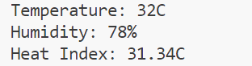
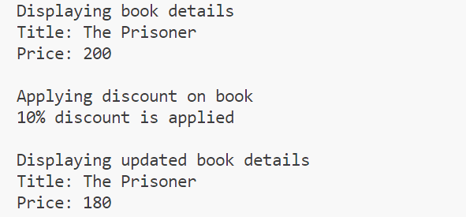
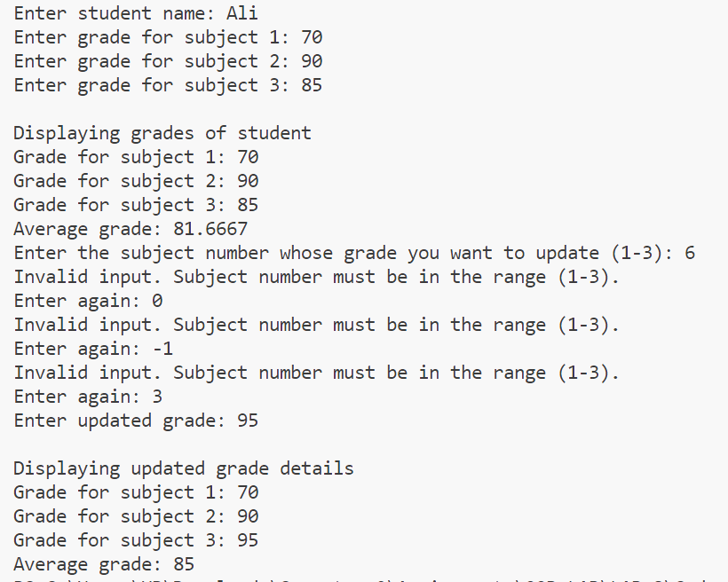
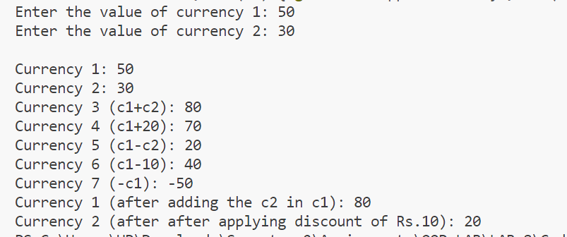
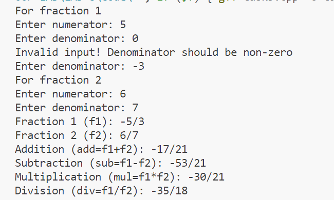

# 24K-0762-OOP-LAB-8

# C++ Code Repository

## Preview
Here are the sample outputs of the programs:

### Task 1 Output:


### Task 2:


### Task 3:


### Task 4:


### Task 5:



---

## Code
Below are the C++ programs:

### Program 1: 
```cpp

#include<iostream>
using namespace std;
class Humidity;
class Temperature{
    int temp;
    public:
        Temperature(int t){
            temp=t;
        }
        friend float calculateHeatIndex(Temperature t,Humidity h);
};
class Humidity{
    int hum;
    public:
        Humidity(int h){
            hum=h;
        }
        friend float calculateHeatIndex(Temperature t,Humidity h);
};
float calculateHeatIndex(Temperature t,Humidity h){
    float heat_index;
    heat_index=t.temp+(0.33*h.hum)-(0.7*t.temp)-4;
    return heat_index;
}
int main(){
    Temperature t1(32);
    Humidity h1(78);
    cout<<"Temperature: 32C"<<endl<<"Humidity: 78%"<<endl<<"Heat Index: "<<calculateHeatIndex(t1,h1)<<"C";
    return 0;
}


## Code
Below are the C++ programs:

### Program 2: 
```cpp
#include<iostream>
using namespace std;
class Librarian;
class Book{
    string title;
    float price;
    public:
        Book(string title,float price){
            this->title=title;
            this->price=price;
        }
        friend class Librarian;
};
class Librarian{
    public:
        void display_book_details(Book b){
            cout<<"Title: "<<b.title<<endl;
            cout<<"Price: "<<b.price<<endl;
        }
        void apply_discount(Book *b){
            b->price=(b->price*90)/100;
            cout<<"10% discount is applied"<<endl;
        }
};
int main(){
    Book book("The Prisoner",200);
    Librarian lib;
    cout<<"Displaying book details"<<endl;
    lib.display_book_details(book);
    cout<<endl<<"Applying discount on book"<<endl;
    lib.apply_discount(&book);
    cout<<endl<<"Displaying updated book details"<<endl;
    lib.display_book_details(book);
    return 0;
}


## Code
Below are the C++ programs:

### Program 3: 
```cpp
#include<iostream>
using namespace std;
class Teacher;
class Student{
    string name;
    int grades[3];
    friend class Teacher;
    friend float calculateAverageGrade(Student s);
    public:
        Student(string name,int grade[]){
            this->name=name;
            for(int i=0;i<3;i++){
                grades[i]=grade[i];
            }
        }
};
class Teacher{
    public:
        void view_grades(Student s){
            for(int i=0;i<3;i++){
                cout<<"Grade for subject "<<i+1<<": "<<s.grades[i]<<endl;
            }
        }
        void update_grade(Student &s){
            int subject;
            cout<<"Enter the subject number whose grade you want to update (1-3): ";
            cin>>subject;
            while(subject>3||subject<1){
                cout<<"Invalid input. Subject number must be in the range (1-3).\nEnter again: ";
                cin>>subject;
            }
            cout<<"Enter updated grade: ";
            cin>>s.grades[subject-1];
        }
};
float calculateAverageGrade(Student s){
    int sum=0;
    for(int i=0;i<3;i++){
        sum+=s.grades[i];
    }
    return sum/3.0;
}
int main(){
    int grades[3];
    string name;
    cout<<"Enter student name: ";
    cin>>name;
    for(int i=0;i<3;i++){
        cout<<"Enter grade for subject "<<i+1<<": ";
        cin>>grades[i];
    }
    Student student(name,grades);
    Teacher teacher;
    cout<<endl<<"Displaying grades of student"<<endl;
    teacher.view_grades(student);
    cout<<"Average grade: "<<calculateAverageGrade(student);
    cout<<endl;
    teacher.update_grade(student);
    cout<<endl<<"Displaying updated grade details"<<endl;
    teacher.view_grades(student);
    cout<<"Average grade: "<<calculateAverageGrade(student);
    return 0;
}


## Code
Below are the C++ programs:

### Program 4: 
```cpp

#include<iostream>
using namespace std;
class Currency{
    int value;
    public:
        Currency(int a):value(a){}
        Currency operator +(const Currency &obj){
            return Currency(value+obj.value);
        }
        Currency operator -(const Currency &obj){
            return Currency(value-obj.value);
        }
        Currency operator -(){
            return Currency(-value);
        }
        Currency& operator +=(const Currency &obj){
            value+=obj.value;
            return *this;
        }
        void operator -=(const Currency &obj){
            value-=obj.value;
        }
        friend ostream& operator <<(ostream &os,const Currency &curr);
};
ostream& operator <<(ostream &os,const Currency &curr){
    os<<curr.value;
    return os;
}
int main(){
    int num;
    cout<<"Enter the value of currency 1: ";
    cin>>num;
    Currency c1(num);
    cout<<"Enter the value of currency 2: ";
    cin>>num;
    Currency c2(num);
    Currency c3=c1+c2,c4=c1+20,c5=c1-c2,c6=c1-10,c7=-c1;
    cout<<endl<<"Currency 1: "<<c1;
    cout<<endl<<"Currency 2: "<<c2;
    cout<<endl<<"Currency 3 (c1+c2): "<<c3;
    cout<<endl<<"Currency 4 (c1+20): "<<c4;
    cout<<endl<<"Currency 5 (c1-c2): "<<c5;
    cout<<endl<<"Currency 6 (c1-10): "<<c6;
    cout<<endl<<"Currency 7 (-c1): "<<c7;
    c1+=c2;
    c2-=10;
    cout<<endl<<"Currency 1 (after adding the c2 in c1): "<<c1;
    cout<<endl<<"Currency 2 (after after applying discount of Rs.10): "<<c2;
    return 0;
}


## Code
Below are the C++ programs:

### Program 5: 
```cpp
#include<iostream>
using namespace std;
class Fraction{
    int numerator,denominator;
    public:
        Fraction(int num,int den){
            numerator=num;
            if(den!=0){
                denominator=den;
            }
            else{
                do{
                    cout<<"Invalid input! Denominator should be non-zero\nEnter denominator: ";
                    cin>>denominator;
                }while(denominator==0);
            }
            if(denominator<0){
                numerator=-numerator;
                denominator=-denominator;
            }
        }
        Fraction operator +(const Fraction &obj){
            int num=(numerator*obj.denominator)+(obj.numerator*denominator);
            int den=denominator*obj.denominator;
            return Fraction(num,den);
        }
        Fraction operator -(const Fraction &obj){
            int num=(numerator*obj.denominator)-(obj.numerator*denominator);
            int den=denominator*obj.denominator;
            return Fraction(num,den);
        }
        Fraction operator *(const Fraction &obj){
            int num=numerator*obj.numerator;
            int den=denominator*obj.denominator;
            return Fraction(num,den);
        }
        Fraction operator /(const Fraction &obj){
            int num=numerator*obj.denominator;
            int den=denominator*obj.numerator;
            return Fraction(num,den);
        }
        friend ostream& operator <<(ostream &os,const Fraction &f);
};
ostream& operator <<(ostream &os,const Fraction &f){
    os<<f.numerator<<"/"<<f.denominator;
    return os;
}
int main(){
    int num,den;
    cout<<"For fraction 1"<<endl;
    cout<<"Enter numerator: ";
    cin>>num;
    cout<<"Enter denominator: ";
    cin>>den;
    Fraction f1(num,den);
    cout<<"For fraction 2"<<endl;
    cout<<"Enter numerator: ";
    cin>>num;
    cout<<"Enter denominator: ";
    cin>>den;
    Fraction f2(num,den);
    Fraction add=f1+f2,sub=f1-f2,mul=f1*f2,div=f1/f2;
    cout<<"Fraction 1 (f1): "<<f1<<endl;
    cout<<"Fraction 2 (f2): "<<f2<<endl;
    cout<<"Addition (add=f1+f2): "<<add<<endl;
    cout<<"Subtraction (sub=f1-f2): "<<sub<<endl;
    cout<<"Multiplication (mul=f1*f2): "<<mul<<endl;
    cout<<"Division (div=f1/f2): "<<div<<endl;
    return 0;
}


 


